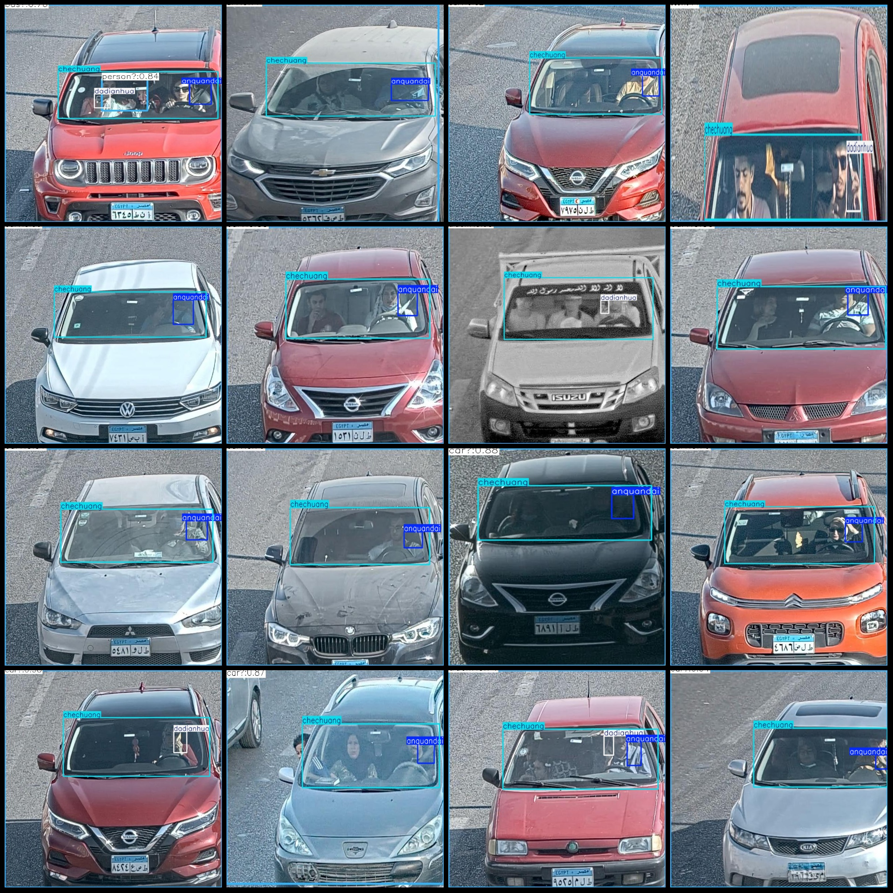
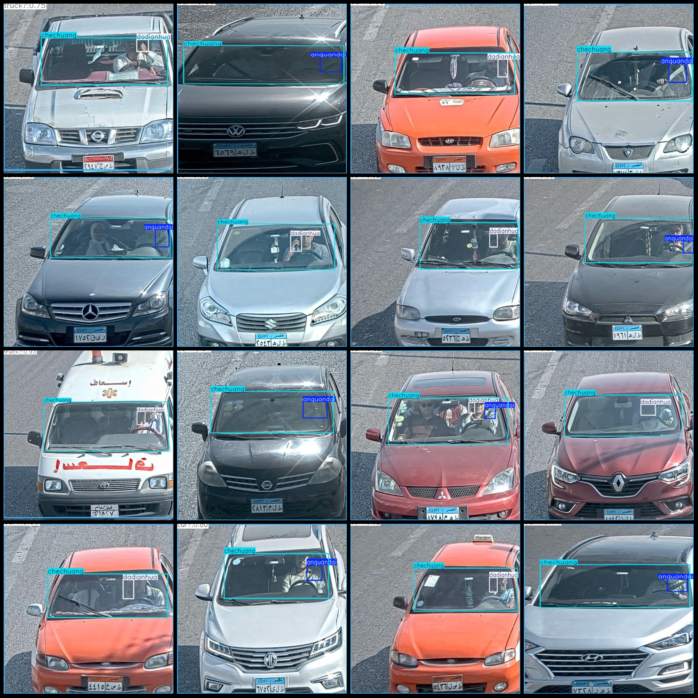

# High-Speed Monitoring Perspective Capturing Safety Belt Talking on the Window Detection Data Set 1116 Images in 3 Categories

Dataset format: Pascal VOC format + YOLO format (txt files without split paths, only containing JPG images along with corresponding VOC format xml files and YOLO format txt files)
Number of images (JPG file count): 1116
Number of annotations (xml file count): 1116
Number of annotations (txt file count): 1116
Number of annotation categories: 3
Annotation category names (note that the order of categories in YOLO format does not correspond to this, but is based on the labels folder classes.txt): ["anquandai", "chechuang", "dadianhua"]
Number of bounding boxes per category:
anquandai (safety belt) = 678
chechuang (window) = 1118
dadianhua (talking) = 487
Total number of bounding boxes: 2283
Number of images per category:
anquandai = 678
chechuang = 1115
dadianhua = 474
Image resolution: Multi-resolution images, such as 382x674, 640x504, etc.
Used labeling tool: labelImg
Labeling rules: Draw a rectangle around the category
Important note: The dataset does not have separate training, validation, or test sets; you need to divide them yourself.
Special declaration: This dataset does not guarantee the accuracy of the trained models or weight files.
Image preview:
Annotation example:

## Images

Here is a pay link on Stripe ( https://buy.stripe.com/3cs8yP7sY87d0vu9AB ). Please contact me lonlonago@foxmail.com after funding $89, and I will send you a complete data files , thank you!

